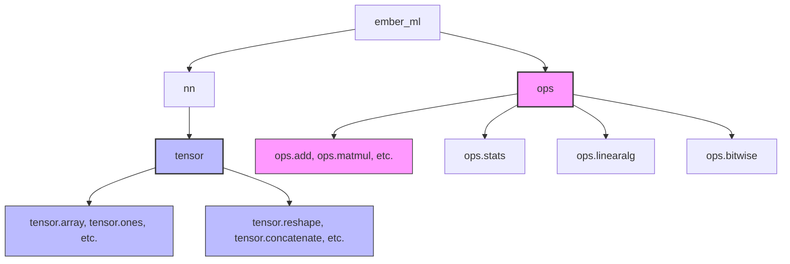
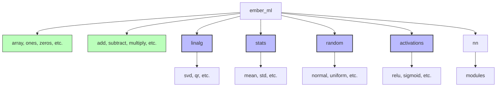
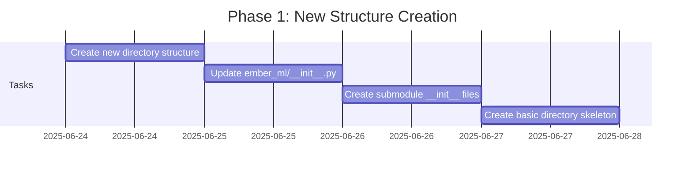
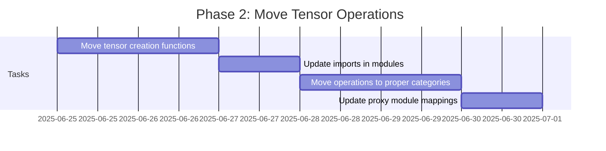
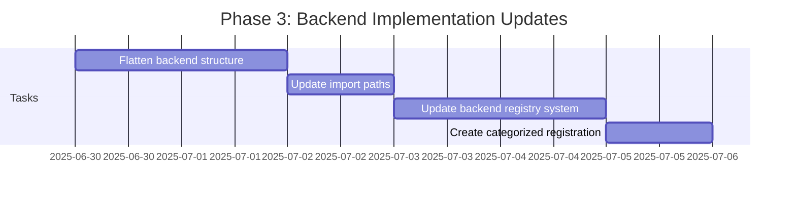
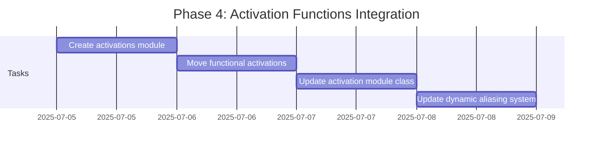
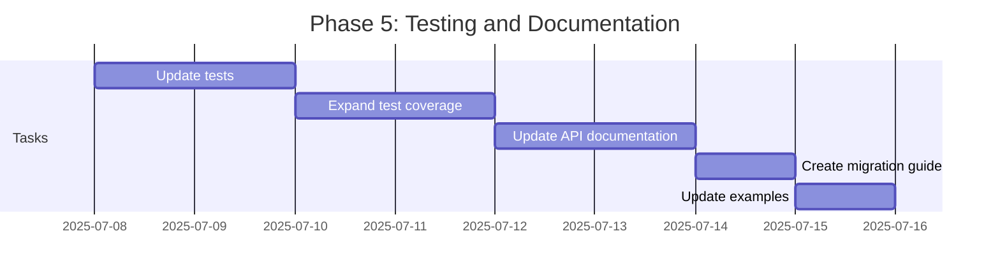
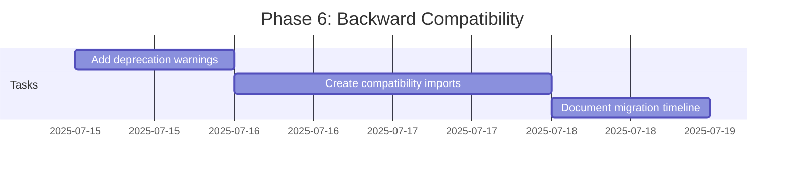
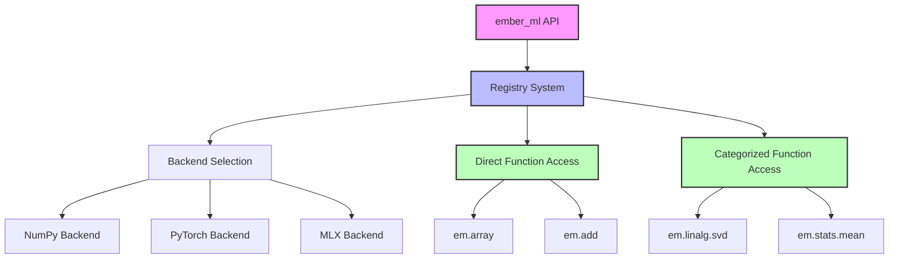

# Ember ML API Reorganization Plan

## Overview

This document outlines the plan to reorganize the Ember ML API to create a more intuitive and consistent user experience. The primary goals are:

1. Move tensor creation functions to the top level for easier access
2. Consolidate operations in a logical, categorized structure
3. Simplify the backend system while maintaining flexibility
4. Create a more intuitive experience that aligns with user expectations

## Current Structure Issues

The current API structure has led to confusion and usability issues:

1. Operations are split between `ember_ml.nn.tensor` and `ember_ml.ops`
2. Tensor creation and manipulation are separated
3. Users (including maintainers) struggle to remember where to find specific operations
4. The structure doesn't align with common expectations based on other libraries like PyTorch, NumPy, and MLX



## Target Structure

The proposed structure consolidates operations and brings tensor creation to the top level:



## Key API Changes

### Current API Usage

```python
from ember_ml import tensor
from ember_ml import ops

# Create tensors
x = tensor.array([1, 2, 3])
zeros = tensor.zeros((2, 3))

# Perform operations
y = ops.add(x, x)
z = tensor.reshape(y, (3, 1))  # Some ops are in tensor module
```

### New API Usage

```python
import ember_ml as em

# Create tensors at top level
x = em.array([1, 2, 3])
zeros = em.zeros((2, 3))

# Perform operations at top level
y = em.add(x, x)
z = em.reshape(y, (3, 1))  # All ops at top level

# Specialized operations in organized submodules
result = em.linalg.svd(z)
```

## Implementation Plan

The implementation will proceed in phases to minimize disruption while ensuring a smooth transition.

### Phase 1: New Structure Creation



**Tasks:**
1. Create new directory structure for top-level modules:
   - `ember_ml/linalg/`
   - `ember_ml/stats/`
   - `ember_ml/random/`
   - `ember_ml/activations/`

2. Create skeleton `__init__.py` files with import placeholders.

3. Update `ember_ml/__init__.py` to include imports for new organization.

### Phase 2: Move Tensor Operations



**Tasks:**
1. Move tensor creation functions from `nn.tensor.common` to top level.
2. Update imports in all modules to use new API.
3. Reorganize operations based on categories.
4. Update proxy module mappings to reflect new organization.

### Phase 3: Backend Implementation Updates



**Tasks:**
1. Flatten backend structure by merging `backend/*/tensor` into main backend folders.
2. Update import paths throughout the codebase.
3. Enhance registry to support categories.
4. Create registration functions for categorized operations.

### Phase 4: Activation Functions Integration



**Tasks:**
1. Create dedicated top-level `activations` module.
2. Move functional activation operations from backend.
3. Update module classes in `nn.modules.activations`.
4. Update dynamic aliasing system for activation functions.

### Phase 5: Testing and Documentation



**Tasks:**
1. Update import paths in all tests.
2. Add new tests for the reorganized API.
3. Update API documentation to reflect new structure.
4. Create migration guide for users.
5. Update examples to use new API pattern.

### Phase 6: Backward Compatibility (Optional)



**Tasks:**
1. Add deprecation warnings to old API paths.
2. Create temporary compatibility imports.
3. Document migration timeline for API changes.

## File Modification List

### Core Structure Files

1. **`ember_ml/__init__.py`**
   - Add imports for all top-level functions
   - Re-export submodule functions
   - Create new API patterns

2. **`ember_ml/ops/__init__.py`**
   - Update to export top-level operations
   - Reorganize operations by category

3. **`ember_ml/ops/proxy.py`**
   - Update proxy module mappings
   - Enhance for categorized operation support

### Backend System Files

1. **`ember_ml/backend/__init__.py`**
   - Update backend initialization
   - Modify backend registration

2. **`ember_ml/backend/registry.py`**
   - Enhance registry to support categories
   - Update registration mechanisms

3. **Backend-specific implementation files**
   - Flatten directory structure
   - Move tensor operations to appropriate categories

### Tensor Files

1. **`ember_ml/nn/tensor/__init__.py`**
   - Update to use new API
   - Add compatibility imports

2. **`ember_ml/nn/tensor/common/__init__.py`**
   - Move operations to appropriate new locations
   - Add compatibility imports

### New Module Files

1. **`ember_ml/linalg/__init__.py`**
   - Import linear algebra operations
   - Register with backend system

2. **`ember_ml/stats/__init__.py`**
   - Import statistics operations
   - Register with backend system

3. **`ember_ml/random/__init__.py`**
   - Import random operations
   - Register with backend system

4. **`ember_ml/activations/__init__.py`**
   - Import activation functions
   - Register with backend system

## Backend System Design

The updated backend system will support both direct access and categorized operations:



## Example Migration

### Before:

```python
from ember_ml import tensor
from ember_ml import ops

x = tensor.ones((3, 3))
y = ops.matmul(x, x)
z = tensor.reshape(y, (9,))
```

### After:

```python
import ember_ml as em

x = em.ones((3, 3))
y = em.matmul(x, x)
z = em.reshape(y, (9,))

# Or with specialized imports:
from ember_ml import linalg
w = linalg.svd(y)
```

## Conclusion

This API reorganization will significantly improve the user experience by providing a more intuitive and consistent API that aligns with user expectations. By centralizing tensor operations at the top level while maintaining logically organized categories, we achieve both simplicity for common tasks and clarity for specialized operations.

The phased implementation approach allows for careful testing and documentation at each stage, minimizing the risk of disruption while moving toward a more maintainable and user-friendly API structure.
