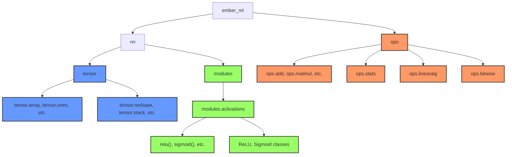
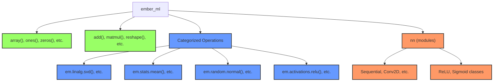
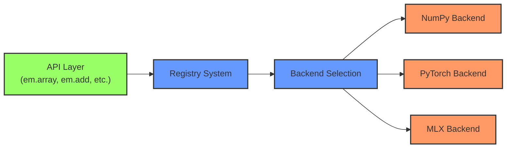
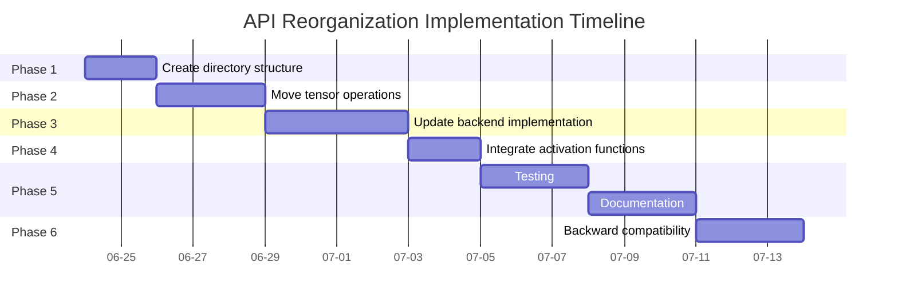

# Ember ML API Structure Visualization

## Current API Structure

The current Ember ML API structure divides operations between different modules, creating confusion about where to find specific functionality.



## New API Structure

The proposed API structure brings commonly used functions to the top level while organizing specialized functions into logical categories.



## Import Pattern Comparison

### Current Import Pattern:
```python
# Multiple import locations
from ember_ml import tensor
from ember_ml import ops

# Mixed operation locations
x = tensor.array([1, 2, 3])  # tensor creation
y = ops.add(x, x)            # ops module
z = tensor.reshape(y, (3,))  # tensor module again
```

### New Import Pattern:
```python
# Simple top-level import
import ember_ml as em

# Consistent operation location
x = em.array([1, 2, 3])      # top level
y = em.add(x, x)             # top level
z = em.reshape(y, (3,))      # top level

# Specialized operations with clear categorization
w = em.linalg.svd(z)         # categorized
```

## Backend System

The backend system will maintain the same functionality while supporting the new API structure:



## Implementation Strategy



This visualization provides a clear comparison between the current and proposed API structures, showing how the reorganization will create a more intuitive and consistent user experience.
