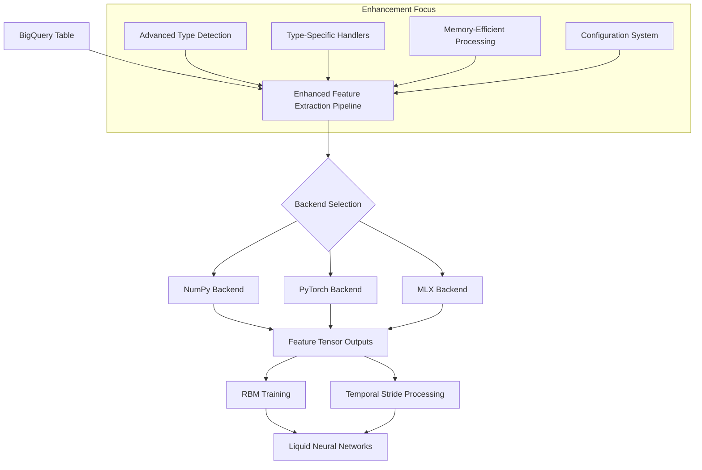
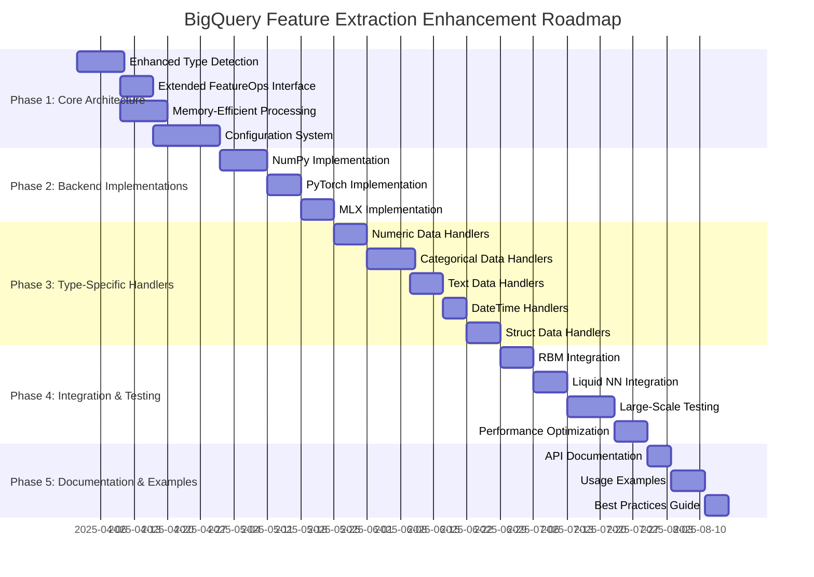

# EmberML BigQuery Feature Extraction Enhancement Plan

## Executive Summary

This document outlines a comprehensive plan to enhance the BigQuery feature extraction components of the EmberML framework, with a focus on best practices for handling various data types. The enhancements will maintain full compatibility with EmberML's backend-agnostic architecture, ensuring all operations work seamlessly across NumPy, PyTorch, and MLX backends.

## Background

EmberML has a sophisticated architecture with multiple layers:

- **Backend System**: Supports NumPy, PyTorch, and MLX backends with seamless switching
- **Operations Layer**: Backend-agnostic operations through `ember_ml.ops`
- **Feature Extraction**: Components for processing and transforming data
- **Model Layer**: RBMs and liquid neural networks for advanced machine learning

The current BigQuery feature extraction pipeline provides:
- Basic data type detection (numeric, categorical, datetime, struct, boolean)
- Simple feature scaling and encoding
- Chunked processing for terabyte-scale data
- BigFrames integration

## Design Goals

1. **Backend Compatibility**: All enhancements must work with all supported backends
2. **Memory Efficiency**: Maintain or improve memory efficiency for terabyte-scale data
3. **Data Type Enhancement**: Improve handling of various BigQuery data types
4. **Configurability**: Make feature extraction configurable via JSON/YAML
5. **RBM Integration**: Ensure optimal input preparation for RBM and LNN components

## Architecture Overview



## Detailed Enhancement Plan

### 1. Enhanced Type Detection and Analysis

Create a more sophisticated type detection system that analyzes BigQuery schema metadata and data samples to make intelligent decisions about feature processing.

```python
class EnhancedTypeDetector:
    """Enhanced type detection with advanced BigQuery schema analysis."""
    
    def analyze_column_type(
        self, 
        column_name: str, 
        bq_dtype: str,  # BigQuery data type
        sample_data: Any,
        stats: Optional[Dict] = None
    ) -> Dict[str, Any]:
        """
        Analyze a BigQuery column and determine optimal processing.
        Uses ops module for backend-agnostic implementation.
        """
        from ember_ml import ops
        
        analysis = {
            'name': column_name,
            'bq_type': bq_dtype,
            'inferred_type': self._infer_ember_type(bq_dtype),
            'cardinality': None,
            'statistics': {},
            'recommended_strategy': None
        }
        
        # Convert sample data to tensor using backend-agnostic ops
        tensor_data = tensor.convert_to_tensor(sample_data)
        
        # Compute statistics based on data type
        if analysis['inferred_type'] == 'numeric':
            analysis['statistics'] = self._analyze_numeric(tensor_data)
            analysis['recommended_strategy'] = self._recommend_numeric_strategy(
                analysis['statistics']
            )
        elif analysis['inferred_type'] == 'categorical':
            unique_values, counts = self._compute_unique_with_counts(tensor_data)
            analysis['cardinality'] = tensor.shape(unique_values)[0]
            analysis['statistics'] = self._analyze_categorical(unique_values, counts)
            analysis['recommended_strategy'] = self._recommend_categorical_strategy(
                analysis['cardinality'], 
                analysis['statistics']
            )
        elif analysis['inferred_type'] == 'datetime':
            analysis['statistics'] = self._analyze_datetime(tensor_data)
            analysis['recommended_strategy'] = 'cyclical_encoding'
        elif analysis['inferred_type'] == 'text':
            analysis['statistics'] = self._analyze_text(tensor_data)
            analysis['recommended_strategy'] = self._recommend_text_strategy(
                analysis['statistics']
            )
        elif analysis['inferred_type'] == 'struct':
            analysis['statistics'] = self._analyze_struct(tensor_data)
            analysis['recommended_strategy'] = 'recursive_flatten'
        
        return analysis
```

Implementation will leverage ember_ml's ops module for all operations, ensuring backend-agnostic behavior.

### 2. Type-Specific Processing Strategies

#### 2.1 Extended Feature Operations Interface

Extend the existing `FeatureOps` interface with new methods for advanced feature engineering:

```python
class ExtendedFeatureOps(FeatureOps):
    """Extended feature operations for enhanced BigQuery data processing."""
    
    @abstractmethod
    def target_encode(
        self,
        X: Any,  # Categorical feature tensor
        y: Any,  # Target tensor
        min_samples_leaf: int = 1,
        smoothing: float = 1.0
    ) -> Dict[str, Any]:
        """
        Apply target encoding to categorical features.
        
        Returns:
            Dict containing:
            - encoded_values: Encoded tensor
            - mapping: Dictionary mapping categories to encodings
        """
        pass
    
    @abstractmethod
    def hash_encode(
        self,
        X: Any,  # Feature tensor
        n_components: int = 8,
        seed: int = 42
    ) -> Any:
        """
        Apply hash encoding to high-cardinality categorical features.
        """
        pass
    
    @abstractmethod
    def cyclical_encode(
        self,
        X: Any,  # Datetime or numeric feature tensor
        period: float,
        start_value: float = 0.0
    ) -> Tuple[Any, Any]:
        """
        Apply cyclical encoding using sine and cosine transforms.
        
        Returns:
            Tuple containing:
            - sin_values: Sine transformed values
            - cos_values: Cosine transformed values
        """
        pass
    
    # Additional methods for other strategies...
```

#### 2.2 Backend-Specific Implementations

Create backend-specific implementations for NumPy, PyTorch, and MLX:

```python
# NumPy implementation example
class NumpyExtendedFeatureOps(ExtendedFeatureOps):
    """NumPy implementation of extended feature operations."""
    
    def target_encode(
        self,
        X: Any,
        y: Any,
        min_samples_leaf: int = 1,
        smoothing: float = 1.0
    ) -> Dict[str, Any]:
        """NumPy implementation of target encoding."""
        X_tensor = convert_to_tensor(X)
        y_tensor = convert_to_tensor(y)
        
        # Convert to numpy for processing
        X_np = np.asarray(X_tensor)
        y_np = np.asarray(y_tensor)
        
        # Compute target statistics
        mapping = {}
        global_mean = np.mean(y_np)
        
        # Process each unique category
        unique_values = np.unique(X_np)
        result = np.zeros_like(X_np, dtype=np.float32)
        
        for value in unique_values:
            mask = X_np == value
            n_samples = np.sum(mask)
            
            if n_samples >= min_samples_leaf:
                category_mean = np.mean(y_np[mask])
                # Apply smoothing
                weight = n_samples / (n_samples + smoothing)
                encoding = weight * category_mean + (1 - weight) * global_mean
            else:
                encoding = global_mean
                
            mapping[value] = encoding
            result[mask] = encoding
        
        return {
            'encoded_values': result,
            'mapping': mapping
        }
    
    # Implement other methods...
```

Similar implementations would be created for PyTorch and MLX backends.

### 3. Memory-Efficient Column-by-Column Processing

Implement a column-by-column processing approach that reduces memory footprint while handling terabyte-scale data:

```python
class MemoryEfficientProcessor:
    """Memory-efficient processing for terabyte-scale BigQuery data."""
    
    def __init__(self, max_memory_gb: float = 16.0, chunk_size: int = 100000):
        """Initialize with memory constraints."""
        self.max_memory_gb = max_memory_gb
        self.chunk_size = chunk_size
        self.processed_columns = {}
        
    def process_column(
        self,
        project_id: str,
        table_id: str,
        column_name: str,
        processing_strategy: str,
        strategy_params: Dict[str, Any],
        temp_storage_path: Optional[str] = None
    ) -> str:
        """
        Process a single column with the specified strategy.
        
        Args:
            project_id: GCP project ID
            table_id: BigQuery table ID
            column_name: Column to process
            processing_strategy: Strategy name
            strategy_params: Parameters for the strategy
            temp_storage_path: Optional path for temp storage
            
        Returns:
            Path to the processed column data
        """
        from ember_ml import ops
        
        # Create optimized query
        query = f"""
        SELECT {column_name}
        FROM `{project_id}.{table_id}`
        """
        
        # Process in chunks to minimize memory usage
        result_chunks = []
        offset = 0
        
        while True:
            # Get chunk of data
            chunk_query = f"{query} LIMIT {self.chunk_size} OFFSET {offset}"
            chunk_df = self._execute_query(chunk_query)
            
            if len(chunk_df) == 0:
                break
                
            # Convert to tensor
            chunk_tensor = tensor.convert_to_tensor(chunk_df[column_name].values)
            
            # Apply processing strategy
            processed_chunk = self._apply_strategy(chunk_tensor, processing_strategy, strategy_params)
            
            # Store result
            if temp_storage_path:
                chunk_path = f"{temp_storage_path}/{column_name}_{offset}.npy"
                ops.save(processed_chunk, chunk_path)
                result_chunks.append(chunk_path)
            else:
                result_chunks.append(processed_chunk)
                
            # Move to next chunk
            offset += self.chunk_size
            
            # Monitor memory usage
            self._check_memory_usage()
        
        # Combine results
        if temp_storage_path:
            final_path = f"{temp_storage_path}/{column_name}_processed.npy"
            self._combine_saved_chunks(result_chunks, final_path)
            return final_path
        else:
            return ops.concatenate(result_chunks, axis=0)
            
    def _apply_strategy(self, tensor, strategy, params):
        """Apply processing strategy using ops module."""
        if strategy == 'standardize':
            return ops.standardize(tensor, **params)[0]
        elif strategy == 'normalize':
            return ops.normalize(tensor, **params)
        elif strategy == 'target_encode':
            # Need target data - would be handled specially
            pass
        # Add other strategies...
```

### 4. Configuration-Driven System

Create a configuration system that allows users to specify feature extraction rules:

```python
class ConfigurableFeatureExtractor:
    """Feature extractor driven by configuration."""
    
    def __init__(
        self,
        project_id: str,
        config_path: Optional[str] = None,
        preferred_backend: Optional[str] = None
    ):
        """Initialize with configuration."""
        # Set backend if specified
        if preferred_backend:
            from ember_ml import ops
            ops.set_backend(preferred_backend)
            
        self.project_id = project_id
        self.config = self._load_config(config_path)
        self.detector = EnhancedTypeDetector()
        self.processor = MemoryEfficientProcessor()
        
    def _load_config(self, config_path: Optional[str]) -> Dict:
        """Load configuration from file or use defaults."""
        if config_path and os.path.exists(config_path):
            import json
            with open(config_path, 'r') as f:
                try:
                    return json.load(f)
                except json.JSONDecodeError:
                    import yaml
                    f.seek(0)
                    return yaml.safe_load(f)
        return self._default_config()
        
    def _default_config(self) -> Dict:
        """Create default configuration."""
        return {
            "column_rules": [],
            "default_rules": {
                "numeric": {
                    "strategy": "standardize",
                    "params": {"with_mean": True, "with_std": True}
                },
                "categorical": {
                    "strategy": "auto",
                    "params": {}
                },
                "datetime": {
                    "strategy": "cyclical_encoding",
                    "params": {}
                },
                "text": {
                    "strategy": "tfidf",
                    "params": {"max_features": 100}
                },
                "struct": {
                    "strategy": "flatten",
                    "params": {"max_depth": 3}
                }
            }
        }
```

Example configuration file:

```json
{
  "column_rules": [
    {
      "pattern": ".*_id$",
      "type": "categorical",
      "strategy": "hash_encoding",
      "params": {"n_components": 16}
    },
    {
      "pattern": ".*timestamp$",
      "type": "datetime",
      "strategy": "cyclical_encoding",
      "params": {"include_holidays": true}
    },
    {
      "columns": ["device_type", "browser"],
      "type": "categorical",
      "strategy": "target_encoding",
      "params": {"smoothing": 10}
    }
  ],
  "default_rules": {
    "numeric": {
      "strategy": "robust_scale",
      "params": {"quantile_range": [0.05, 0.95]}
    },
    "categorical": {
      "strategy": "auto",
      "params": {}
    },
    "text": {
      "strategy": "tfidf",
      "params": {"max_features": 100}
    },
    "datetime": {
      "strategy": "cyclical_encoding",
      "params": {}
    },
    "struct": {
      "strategy": "flatten",
      "params": {"max_depth": 2}
    }
  }
}
```

### 5. Integration with RBM and Liquid Neural Networks

Enhance the integration with downstream components:

```python
class RBMFeatureOptimizer:
    """Optimize features for RBM training."""
    
    def prepare_for_rbm(
        self,
        features: Any,
        settings: Dict[str, Any]
    ) -> Tuple[Any, Dict[str, Any]]:
        """
        Prepare features for optimal RBM processing.
        
        Args:
            features: Feature tensor or list of tensors
            settings: RBM settings
            
        Returns:
            Tuple containing:
            - optimized_features: Tensor ready for RBM
            - metadata: Information about the optimization
        """
        from ember_ml import ops
        
        # Convert to tensor if needed
        if isinstance(features, list):
            features = ops.concatenate(features, axis=1)
            
        # Ensure all values are in [0,1] for RBMs
        features_min = ops.stats.min(features, axis=0, keepdims=True)
        features_max = ops.stats.max(features, axis=0, keepdims=True)
        features_range = ops.subtract(features_max, features_min)
        features_range = ops.maximum(features_range, tensor.convert_to_tensor(1e-8))
        
        normalized = ops.divide(
            ops.subtract(features, features_min),
            features_range
        )
        
        # Apply additional processing based on RBM settings
        if settings.get('binary_visible', False):
            # For binary RBMs, we need to ensure all values are binary
            threshold = settings.get('binarization_threshold', 0.5)
            binary_features = ops.greater(normalized, tensor.convert_to_tensor(threshold))
            binary_features = tensor.cast(binary_features, 'float32')
            
            return binary_features, {
                'normalization': {
                    'min': features_min,
                    'max': features_max
                },
                'binarization_threshold': threshold
            }
        else:
            return normalized, {
                'normalization': {
                    'min': features_min,
                    'max': features_max
                }
            }
```

## Implementation Roadmap



## Next Steps

1. **Prototype Development**:
   - Implement the core EnhancedTypeDetector
   - Create a minimal version of the configuration system
   - Test with a small BigQuery table

2. **Iterative Expansion**:
   - Add support for more data types
   - Implement backend-specific optimizations
   - Benchmark against large datasets

3. **Integration Testing**:
   - Test with RBM models
   - Ensure compatibility with Liquid NN processing
   - Verify memory efficiency at scale

## Conclusion

This enhancement plan will significantly improve BigQuery feature extraction in EmberML by:

1. Adding sophisticated data type detection and handling
2. Providing customizable processing strategies for different data types
3. Maintaining memory efficiency for terabyte-scale data
4. Ensuring backend compatibility across NumPy, PyTorch, and MLX
5. Optimizing features for downstream RBM and LNN processing

The implementation will follow EmberML's backend-agnostic design principles, ensuring all operations work seamlessly across different compute environments.