# EmberHarmony Comprehensive Guide

## Table of Contents

1. [Project Overview](#project-overview)
2. [Architecture](#architecture)
   - [Core Components](#core-components)
   - [Backend Abstraction System](#backend-abstraction-system)
   - [Neural Network Components](#neural-network-components)
   - [Feature Extraction System](#feature-extraction-system)
3. [Folder Structure](#folder-structure)
   - [Root Directory Organization](#root-directory-organization)
   - [Module Organization](#module-organization)
   - [Test Organization](#test-organization)
4. [Backend Purification](#backend-purification)
   - [Purification Goals](#purification-goals)
   - [Purification Process](#purification-process)
   - [Current Status](#current-status)
5. [Feature Extraction Pipeline](#feature-extraction-pipeline)
   - [BigQuery Integration](#bigquery-integration)
   - [Temporal Stride Processing](#temporal-stride-processing)
   - [RBM Feature Learning](#rbm-feature-learning)
6. [Liquid Neural Networks](#liquid-neural-networks)
   - [CfC Architecture](#cfc-architecture)
   - [Neural Circuit Policies](#neural-circuit-policies)
   - [Motor Neuron Output](#motor-neuron-output)
7. [Testing Framework](#testing-framework)
   - [Unit Testing](#unit-testing)
   - [Integration Testing](#integration-testing)
   - [Performance Testing](#performance-testing)
8. [Remaining Tasks](#remaining-tasks)
   - [Backend Purification Tasks](#backend-purification-tasks)
   - [Feature Extraction Tasks](#feature-extraction-tasks)
   - [Documentation Tasks](#documentation-tasks)
9. [Development Guidelines](#development-guidelines)
   - [Code Style](#code-style)
   - [Documentation Standards](#documentation-standards)
   - [Testing Requirements](#testing-requirements)

## Project Overview

EmberHarmony is a comprehensive neural network framework designed for efficient feature extraction and processing of terabyte-scale datasets. The project combines several cutting-edge technologies:

1. **Backend Abstraction System**: A unified API that works across different computational backends (NumPy, PyTorch, MLX)
2. **Liquid Neural Networks**: Implementation of various neural architectures including LTC neurons and CfC cells
3. **Feature Extraction**: Tools for processing terabyte-scale datasets with BigQuery integration
4. **Neural Circuit Policies (NCPs)**: Biologically-inspired neural networks with customizable wiring patterns
5. **BigQuery Integration**: Efficient processing of terabyte-scale datasets from Google BigQuery

The framework is designed to be modular, extensible, and backend-agnostic, allowing developers to leverage the most appropriate computational backend for their specific hardware and use case.

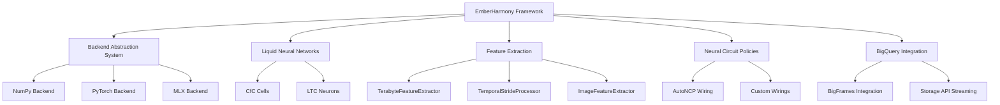

## Architecture

### Core Components

The EmberHarmony architecture is built around a set of core components that work together to provide a comprehensive neural network framework:

1. **Backend System**: Provides a unified API for tensor operations across different computational backends
2. **Operations (ops)**: Implements mathematical operations in a backend-agnostic way
3. **Neural Network (nn)**: Provides building blocks for neural networks
4. **Feature Extraction**: Tools for extracting features from various data sources
5. **Models**: Implementations of various neural network architectures
6. **Utilities**: Helper functions and tools for common tasks

These components are designed to be modular and composable, allowing developers to use only the parts they need for their specific use case.

```mermaid
graph TD
    A[EmberHarmony Core] --> B[Backend System]
    A --> C[Operations]
    A --> D[Neural Network]
    A --> E[Feature Extraction]
    A --> F[Models]
    A --> G[Utilities]
    
    B --> B1[Backend Interface]
    B --> B2[Backend Selection]
    B --> B3[Backend Utilities]
    
    C --> C1[Math Operations]
    C --> C2[Tensor Operations]
    C --> C3[Random Operations]
    
    D --> D1[Layers]
    D --> D2[Cells]
    D --> D3[Wirings]
    
    E --> E1[Column Extraction]
    E --> E2[Temporal Processing]
    E --> E3[BigQuery Integration]
    
    F --> F1[RBM]
    F --> F2[Liquid Networks]
    F --> F3[Neural Circuit Policies]
    
    G --> G1[IO Utilities]
    G --> G2[Visualization]
    G --> G3[Debugging Tools]
```

### Backend Abstraction System

The backend abstraction system is a key component of EmberHarmony, providing a unified API for tensor operations across different computational backends. This allows developers to write code once and have it run efficiently on different hardware platforms.

The system consists of:

1. **Backend Interface**: A common interface for all backends
2. **Backend Selection**: Automatic selection of the optimal backend based on availability
3. **Backend Utilities**: Helper functions for working with different backends
4. **Operations Layer**: Implementation of mathematical operations for each backend

The backend system automatically selects the optimal computational backend (MLX, PyTorch, or NumPy) based on availability, allowing code to run efficiently on different hardware without modification.

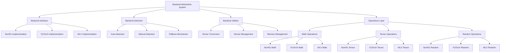

### Neural Network Components

EmberHarmony provides a rich set of neural network components, with a focus on liquid neural networks and neural circuit policies. These components are designed to be modular and composable, allowing developers to create complex neural architectures.

Key neural network components include:

1. **CfC Cells**: Closed-form Continuous-time cells for temporal processing
2. **LTC Neurons**: Liquid Time-Constant neurons for adaptive temporal processing
3. **Neural Circuit Policies**: Biologically-inspired neural networks with customizable wiring patterns
4. **Wirings**: Connectivity patterns for neural networks
5. **Motor Neurons**: Output neurons that can trigger deeper exploration

These components can be combined to create powerful neural architectures for a wide range of applications.

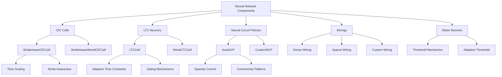

### Feature Extraction System

The feature extraction system in EmberHarmony is designed to efficiently process large-scale datasets, with a particular focus on terabyte-scale data from BigQuery. The system provides tools for extracting features from various data sources, processing them through different stages, and preparing them for neural network training.

Key components of the feature extraction system include:

1. **TerabyteFeatureExtractor**: Extracts features from terabyte-scale datasets
2. **TemporalStrideProcessor**: Processes temporal data with different stride perspectives
3. **ColumnFeatureExtractor**: Extracts features from tabular data
4. **ImageFeatureExtractor**: Extracts features from image data
5. **RBM Feature Learning**: Uses Restricted Boltzmann Machines to learn latent representations

These components work together to provide a comprehensive feature extraction pipeline that can handle a wide range of data types and scales.

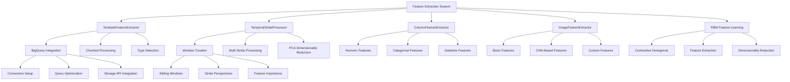

## Folder Structure

### Root Directory Organization

The EmberHarmony project follows a well-organized directory structure at the root level:

```
/
├── emberharmony/           # Main package directory
├── docs/                   # Documentation
├── tests/                  # Tests
├── examples/               # Example code
├── notebooks/              # Jupyter notebooks
├── bigquery-ml/            # BigQuery ML integration
├── controltheory/          # Control theory integration
├── datasets/               # Dataset utilities
├── logs/                   # Log files
├── models/                 # Saved models
├── outputs/                # Output files
├── utils/                  # Utility scripts
├── setup.py                # Package setup file
├── requirements.txt        # Package dependencies
└── README.md               # Project README
```

This organization separates the main package code from documentation, tests, examples, and other supporting files, making it easy to navigate the project.

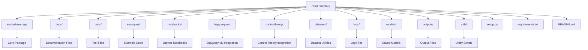

### Module Organization

The main `emberharmony` package is organized into modules that reflect the architecture of the framework:

```
emberharmony/
├── __init__.py
├── attention/           # Attention mechanisms
├── audio/               # Audio processing
├── backend/             # Backend abstraction
├── benchmarks/          # Performance benchmarks
├── core/                # Core functionality
├── data/                # Data handling
├── examples/            # Example implementations
├── features/            # Feature extraction
├── initializers/        # Weight initializers
├── keras_3_8/           # Keras 3.8 integration
├── math/                # Mathematical operations
├── models/              # Model implementations
├── nn/                  # Neural network components
├── ops/                 # Operations
├── solvers/             # Numerical solvers
├── tests/               # Package-level tests
├── training/            # Training utilities
├── utils/               # Utility functions
├── visualization/       # Visualization tools
├── wave/                # Wave processing
└── wirings/             # Neural wirings
```

This organization groups related functionality together, making it easy to find and use specific components of the framework.

```mermaid
graph TD
    A[emberharmony Package] --> B[attention/]
    A --> C[audio/]
    A --> D[backend/]
    A --> E[benchmarks/]
    A --> F[core/]
    A --> G[data/]
    A --> H[examples/]
    A --> I[features/]
    A --> J[initializers/]
    A --> K[keras_3_8/]
    A --> L[math/]
    A --> M[models/]
    A --> N[nn/]
    A --> O[ops/]
    A --> P[solvers/]
    A --> Q[tests/]
    A --> R[training/]
    A --> S[utils/]
    A --> T[visualization/]
    A --> U[wave/]
    A --> V[wirings/]
    
    D --> D1[Backend Interface]
    D --> D2[Backend Selection]
    D --> D3[Backend Utilities]
    
    F --> F1[Core Classes]
    F --> F2[Core Functions]
    
    I --> I1[TerabyteFeatureExtractor]
    I --> I2[TemporalStrideProcessor]
    I --> I3[ColumnFeatureExtractor]
    
    M --> M1[RBM]
    M --> M2[Liquid Networks]
    M --> M3[Neural Circuit Policies]
    
    N --> N1[Cells]
    N --> N2[Layers]
    
    O --> O1[Math Operations]
    O --> O2[Tensor Operations]
    O --> O3[Random Operations]
    
    V --> V1[AutoNCP]
    V --> V2[Custom Wirings]
```

### Test Organization

The tests in EmberHarmony are organized to reflect the structure of the main package, with additional directories for specific test types:

```
tests/
├── __init__.py
├── test_backend_auto_selection.py
├── test_backend.py
├── test_bigquery_feature_extraction.py
├── test_column_feature_extraction.py
├── test_compare_random_ops_purified.py
├── test_detect_numpy_usage.py
├── test_ember_tensor.py
├── test_ncp_pytest.py
├── test_ncp.py
├── test_ops_device.py
├── test_ops_dtype.py
├── test_ops_math.py
├── test_ops_random.py
├── test_ops_tensor.py
├── test_plan.md
├── test_terabyte_feature_extractor_purified_v2.py
├── test_terabyte_feature_extractor_purified.py
├── bigquery/           # BigQuery-specific tests
├── integration/        # Integration tests
├── legacy/             # Legacy tests
├── notebooks/          # Notebook tests
└── pipeline/           # Pipeline tests
```

This organization makes it easy to find and run tests for specific components of the framework.

```mermaid
graph TD
    A[tests Directory] --> B[Unit Tests]
    A --> C[bigquery/]
    A --> D[integration/]
    A --> E[legacy/]
    A --> F[notebooks/]
    A --> G[pipeline/]
    
    B --> B1[Backend Tests]
    B --> B2[Feature Extraction Tests]
    B --> B3[Operations Tests]
    B --> B4[Neural Network Tests]
    
    B1 --> H1[test_backend_auto_selection.py]
    B1 --> H2[test_backend.py]
    
    B2 --> I1[test_bigquery_feature_extraction.py]
    B2 --> I2[test_column_feature_extraction.py]
    B2 --> I3[test_terabyte_feature_extractor_purified.py]
    
    B3 --> J1[test_ops_device.py]
    B3 --> J2[test_ops_dtype.py]
    B3 --> J3[test_ops_math.py]
    B3 --> J4[test_ops_random.py]
    B3 --> J5[test_ops_tensor.py]
    
    B4 --> K1[test_ncp_pytest.py]
    B4 --> K2[test_ncp.py]
    
    C --> C1[BigQuery-specific Tests]
    D --> D1[Integration Tests]
    E --> E1[Legacy Tests]
    F --> F1[Notebook Tests]
    G --> G1[Pipeline Tests]
```

## Backend Purification

### Purification Goals

The backend purification initiative in EmberHarmony has two main components:

1. **Backend Agnosticism**: Replace direct NumPy usage with the backend abstraction system
2. **Backend Migration**: Move backend-specific implementations from the ops directory to the backend directory

The goals of this initiative are:

1. **Backend Agnosticism**: Ensure all code works with any supported backend (NumPy, PyTorch, MLX)
2. **Automatic Acceleration**: Enable automatic GPU acceleration when available
3. **Consistent API**: Provide a consistent API across different backends
4. **Improved Performance**: Achieve better performance on different hardware platforms
5. **Simplified Maintenance**: Make code easier to maintain and extend
6. **Architectural Compliance**: Follow the Frontend-Only and Backend-Only rules

By achieving these goals, EmberHarmony will be more flexible, efficient, and future-proof.

```mermaid
graph TD
    A[Backend Purification Goals] --> B[Backend Agnosticism]
    A --> C[Automatic Acceleration]
    A --> D[Consistent API]
    A --> E[Improved Performance]
    A --> F[Simplified Maintenance]
    A --> G[Architectural Compliance]
    
    B --> B1[NumPy Support]
    B --> B2[PyTorch Support]
    B --> B3[MLX Support]
    
    C --> C1[CPU Optimization]
    C --> C2[GPU Acceleration]
    C --> C3[Apple Silicon Optimization]
    
    D --> D1[Unified Function Signatures]
    D --> D2[Consistent Error Handling]
    D --> D3[Standardized Return Types]
    
    E --> E1[Reduced Overhead]
    E --> E2[Hardware-specific Optimizations]
    E --> E3[Memory Efficiency]
    
    F --> F1[Reduced Code Duplication]
    F --> F2[Centralized Backend Logic]
    F --> F3[Easier Debugging]
    
    G --> G1[Frontend-Only Rule]
    G --> G2[Backend-Only Rule]
    G --> G3[Abstraction-Only Rule]
```

### Purification Process

The backend purification process involves two main components:

#### NumPy Purification

The NumPy purification process involves several steps to replace direct NumPy usage with the backend abstraction system:

1. **Audit**: Identify all direct NumPy usage in the codebase
2. **Map**: Map NumPy functions to their emberharmony.ops equivalents
3. **Replace**: Replace NumPy imports and function calls with emberharmony.ops
4. **Test**: Verify that the code works correctly with different backends
5. **Optimize**: Fine-tune performance for specific backends

```mermaid
graph TD
    A[NumPy Purification] --> B[Audit]
    A --> C[Map]
    A --> D[Replace]
    A --> E[Test]
    A --> F[Optimize]
    
    B --> B1[Identify NumPy Imports]
    B --> B2[Identify NumPy Function Calls]
    B --> B3[Identify NumPy Constants]
    
    C --> C1[Create Function Mapping]
    C --> C2[Create Constant Mapping]
    C --> C3[Identify Missing Equivalents]
    
    D --> D1[Replace Imports]
    D --> D2[Replace Function Calls]
    D --> D3[Replace Constants]
    
    E --> E1[Unit Tests]
    E --> E2[Integration Tests]
    E --> E3[Backend-specific Tests]
    
    F --> F1[Profile Performance]
    F --> F2[Identify Bottlenecks]
    F --> F3[Implement Optimizations]
    
    B1 --> G1[import numpy as np]
    B2 --> G2[np.array(), np.sin(), etc.]
    B3 --> G3[np.pi, np.inf, etc.]
    
    C1 --> H1[np.array() -> ops.convert_to_tensor()]
    C2 --> H2[np.pi -> ops.pi]
    C3 --> H3[Create New Equivalents]
    
    D1 --> I1[from emberharmony import ops]
    D2 --> I2[ops.convert_to_tensor(), ops.sin(), etc.]
    D3 --> I3[ops.pi, ops.inf, etc.]
```

#### Backend Migration

The backend migration process involves moving backend-specific implementations from the ops directory to the backend directory:

1. **Analyze**: Identify operations in ops/torch, ops/mlx, and ops/numpy
2. **Plan**: Generate a migration plan for each backend
3. **Migrate**: Move operations from ops to backend
4. **Update**: Update frontend abstractions to dispatch to backend implementations
5. **Test**: Verify that the code works correctly with different backends
6. **Cleanup**: Remove backend-specific directories from ops

The `analyze_backend_operations.py` tool is used to help with this process, automating many of the steps.

```mermaid
graph TD
    A[Backend Migration] --> B[Analyze]
    A --> C[Plan]
    A --> D[Migrate]
    A --> E[Update]
    A --> F[Test]
    A --> G[Cleanup]
    
    B --> B1[Identify Operations in ops/torch]
    B --> B2[Identify Operations in ops/mlx]
    B --> B3[Identify Operations in ops/numpy]
    
    C --> C1[Generate Migration Plan for torch]
    C --> C2[Generate Migration Plan for mlx]
    C --> C3[Generate Migration Plan for numpy]
    
    D --> D1[Migrate torch Operations]
    D --> D2[Migrate mlx Operations]
    D --> D3[Migrate numpy Operations]
    
    E --> E1[Update Frontend Abstractions]
    E --> E2[Ensure Proper Dispatching]
    E --> E3[Fix Any Issues]
    
    F --> F1[Run Unit Tests]
    F --> F2[Run Integration Tests]
    F --> F3[Verify with EmberLint]
    
    G --> G1[Remove ops/torch]
    G --> G2[Remove ops/mlx]
    G --> G3[Remove ops/numpy]
    
    B1 --> H1[Extract Operations]
    B2 --> H2[Extract Operations]
    B3 --> H3[Extract Operations]
    
    C1 --> I1[Map to Backend File]
    C2 --> I2[Map to Backend File]
    C3 --> I3[Map to Backend File]
    
    D1 --> J1[Move Function Code]
    D2 --> J2[Move Function Code]
    D3 --> J3[Move Function Code]
```

Both processes are applied to each component of the framework, starting with the most critical components and working outward.

### Current Status

The backend purification initiative has two main components: NumPy purification and backend migration. Both components have made progress, but there are still tasks to complete.

#### NumPy Purification Status

Several key components have already been purified:

1. **TerabyteFeatureExtractor**: Fully purified and using the backend abstraction system
2. **TerabyteTemporalStrideProcessor**: Fully purified and using the backend abstraction system
3. **Core Operations**: Partially purified, with ongoing work
4. **Math Operations**: Partially purified, with ongoing work
5. **Random Operations**: Partially purified, with ongoing work

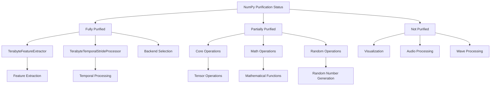

#### Backend Migration Status

The backend migration process has identified several issues that need to be addressed:

1. **Backend-Specific Implementations in ops**: All files in ops/torch, ops/mlx, and ops/numpy contain backend-specific implementations, which violates the architectural rules.
2. **Backend Inconsistencies**: Many operations are implemented inconsistently across backends, with some operations missing in certain backends.
3. **Style and Type Errors**: The emberlint tool has identified style and type errors in the backend files.
4. **Precision-Reducing Casts**: Some backend files use precision-reducing casts like `int()` and `float()`.
5. **Direct Python Operators**: Some backend files use direct Python operators on tensors instead of ops functions.

A checklist has been created to track the migration progress:

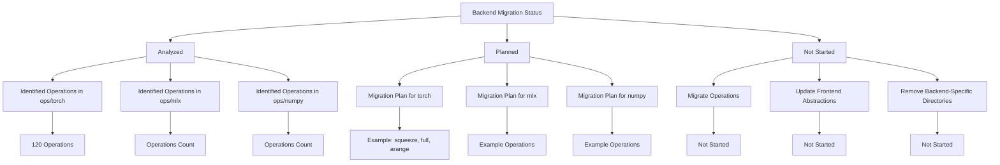

The purification process is ongoing, with a focus on completing the purification of all core components before moving on to less critical components. The backend migration process will be a key part of this effort, ensuring that the codebase follows the architectural rules defined in the `.clinerules-code` file.

## Feature Extraction Pipeline

### BigQuery Integration

EmberHarmony provides robust integration with Google BigQuery for processing terabyte-scale datasets. The BigQuery integration includes:

1. **Connection Setup**: Establishing a connection to BigQuery with appropriate credentials
2. **Query Optimization**: Creating optimized queries for efficient data extraction
3. **Chunked Processing**: Processing data in manageable chunks to avoid memory limitations
4. **Storage API Integration**: Using the BigQuery Storage API for streaming access to data
5. **Arrow-Based Processing**: Using Apache Arrow for memory-efficient data processing

This integration allows EmberHarmony to efficiently process terabyte-scale datasets from BigQuery, making it suitable for large-scale machine learning applications.

```mermaid
graph TD
    A[BigQuery Integration] --> B[Connection Setup]
    A --> C[Query Optimization]
    A --> D[Chunked Processing]
    A --> E[Storage API Integration]
    A --> F[Arrow-Based Processing]
    
    B --> B1[Service Account Authentication]
    B --> B2[Project Configuration]
    B --> B3[Location Settings]
    
    C --> C1[Projection Optimization]
    C --> C2[Filtering Optimization]
    C --> C3[Partitioning Hints]
    
    D --> D1[Chunk Size Configuration]
    D --> D2[Memory Monitoring]
    D --> D3[Result Aggregation]
    
    E --> E1[Streaming Access]
    E --> E2[Parallel Streams]
    E --> E3[Session Management]
    
    F --> F1[Arrow RecordBatch Processing]
    F --> F2[Zero-Copy Conversion]
    F --> F3[Memory-Efficient Operations]
    
    B1 --> G1[Credentials Setup]
    B2 --> G2[Project ID Configuration]
    
    C1 --> H1[Column Selection]
    C2 --> H2[WHERE Clause Optimization]
    
    D1 --> I1[Adaptive Chunk Sizing]
    D2 --> I2[Memory Usage Tracking]
    
    E1 --> J1[Read Session Creation]
    E2 --> J2[Stream Processing]
    
    F1 --> K1[Batch Processing]
    F2 --> K2[Pandas Integration]
```

### Temporal Stride Processing

EmberHarmony includes a powerful temporal stride processing system for analyzing time series data at different time scales. The system includes:

1. **Window Creation**: Creating sliding windows with different stride lengths
2. **Multi-Stride Processing**: Processing data with different stride perspectives
3. **PCA Dimensionality Reduction**: Applying PCA to reduce the dimensionality of windowed data
4. **Feature Importance**: Calculating feature importance based on PCA components
5. **Memory-Efficient Processing**: Processing large datasets efficiently with limited memory

This system allows EmberHarmony to extract meaningful features from temporal data, capturing patterns at different time scales.

```mermaid
graph TD
    A[Temporal Stride Processing] --> B[Window Creation]
    A --> C[Multi-Stride Processing]
    A --> D[PCA Dimensionality Reduction]
    A --> E[Feature Importance]
    A --> F[Memory-Efficient Processing]
    
    B --> B1[Sliding Window Algorithm]
    B --> B2[Window Size Configuration]
    B --> B3[Stride Length Configuration]
    
    C --> C1[Stride Perspectives]
    C --> C2[Perspective Combination]
    C --> C3[Time Scale Factors]
    
    D --> D1[PCA Implementation]
    D --> D2[Component Selection]
    D --> D3[Variance Explanation]
    
    E --> E1[Component Analysis]
    E --> E2[Feature Ranking]
    E --> E3[Visualization]
    
    F --> F1[Batch Processing]
    F --> F2[Incremental PCA]
    F --> F3[Memory Monitoring]
    
    B1 --> G1[Window Creation Algorithm]
    B2 --> G2[Window Size Parameter]
    
    C1 --> H1[Stride Length Selection]
    C2 --> H2[Perspective Weighting]
    
    D1 --> I1[PCA Computation]
    D2 --> I2[Component Count Selection]
    
    E1 --> J1[Importance Calculation]
    E2 --> J2[Feature Selection]
    
    F1 --> K1[Chunk Size Configuration]
    F2 --> K2[Incremental Fitting]
```

### RBM Feature Learning

EmberHarmony uses Restricted Boltzmann Machines (RBMs) for unsupervised feature learning. The RBM feature learning system includes:

1. **RBM Architecture**: Configuring the RBM architecture for feature learning
2. **Contrastive Divergence**: Training RBMs using contrastive divergence
3. **Feature Extraction**: Extracting learned features from the hidden layer
4. **Dimensionality Reduction**: Reducing the dimensionality of the input data
5. **Memory-Efficient Training**: Training RBMs efficiently with limited memory

This system allows EmberHarmony to learn latent representations of the data, capturing complex patterns and relationships.

```mermaid
graph TD
    A[RBM Feature Learning] --> B[RBM Architecture]
    A --> C[Contrastive Divergence]
    A --> D[Feature Extraction]
    A --> E[Dimensionality Reduction]
    A --> F[Memory-Efficient Training]
    
    B --> B1[Visible Layer Configuration]
    B --> B2[Hidden Layer Configuration]
    B --> B3[Weight Initialization]
    
    C --> C1[Gibbs Sampling]
    C --> C2[Weight Updates]
    C --> C3[Learning Rate Scheduling]
    
    D --> D1[Hidden Layer Activation]
    D --> D2[Feature Transformation]
    D --> D3[Feature Normalization]
    
    E --> E1[Dimensionality Selection]
    E --> E2[Information Preservation]
    E --> E3[Reconstruction Quality]
    
    F --> F1[Mini-Batch Processing]
    F --> F2[Incremental Training]
    F --> F3[Memory Monitoring]
    
    B1 --> G1[Input Dimension]
    B2 --> G2[Hidden Units]
    
    C1 --> H1[Sampling Steps]
    C2 --> H2[Update Rules]
    
    D1 --> I1[Activation Function]
    D2 --> I2[Feature Scaling]
    
    E1 --> J1[Hidden Layer Size]
    E2 --> J2[Reconstruction Error]
    
    F1 --> K1[Batch Size]
    F2 --> K2[Epoch Management]
```

## Liquid Neural Networks

### CfC Architecture

EmberHarmony implements Closed-form Continuous-time (CfC) cells for temporal processing. The CfC architecture includes:

1. **CfC Cells**: Basic building blocks for temporal processing
2. **Stride-Aware CfC**: CfC cells that are aware of different stride lengths
3. **Wired CfC**: CfC cells with customizable wiring patterns
4. **Time Scaling**: Adjusting time scales for different temporal patterns
5. **Mixed Memory**: Combining information from different time scales

This architecture allows EmberHarmony to process temporal data efficiently, capturing patterns at different time scales.

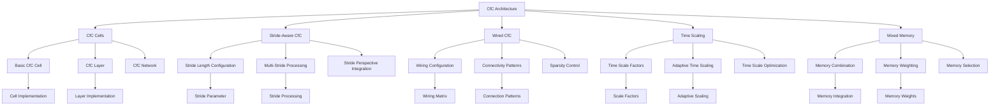

### Neural Circuit Policies

EmberHarmony implements Neural Circuit Policies (NCPs) for biologically-inspired neural networks. The NCP system includes:

1. **AutoNCP**: Automatically generated neural circuit policies
2. **Custom Wirings**: Customizable wiring patterns for neural networks
3. **Sparsity Control**: Controlling the sparsity of neural connections
4. **Connectivity Patterns**: Defining specific connectivity patterns
5. **Biological Inspiration**: Drawing inspiration from biological neural circuits

This system allows EmberHarmony to create neural networks with specific connectivity patterns, mimicking biological neural circuits.

```mermaid
graph TD
    A[Neural Circuit Policies] --> B[AutoNCP]
    A --> C[Custom Wirings]
    A --> D[Sparsity Control]
    A --> E[Connectivity Patterns]
    A --> F[Biological Inspiration]
    
    B --> B1[Automatic Wiring Generation]
    B --> B2[Parameter Configuration]
    B --> B3[Wiring Optimization]
    
    C --> C1[Manual Wiring Definition]
    C --> C2[Wiring Templates]
    C --> C3[Wiring Customization]
    
    D --> D1[Sparsity Parameters]
    D --> D2[Connection Pruning]
    D --> D3[Sparse Updates]
    
    E --> E1[Feed-Forward Patterns]
    E --> E2[Recurrent Patterns]
    E --> E3[Skip Connections]
    
    F --> F1[Neuronal Inspiration]
    F --> F2[Circuit Inspiration]
    F --> F3[Learning Rules]
    
    B1 --> G1[Generation Algorithm]
    B2 --> G2[Configuration Options]
    
    C1 --> H1[Manual Definition]
    C2 --> H2[Template Selection]
    
    D1 --> I1[Sparsity Level]
    D2 --> I2[Pruning Strategy]
    
    E1 --> J1[Layer Connectivity]
    E2 --> J2[Recurrent Connections]
    
    F1 --> K1[Neuron Models]
    F2 --> K2[Circuit Patterns]
```

### Motor Neuron Output

EmberHarmony implements motor neurons for generating output signals that can trigger deeper exploration. The motor neuron system includes:

1. **Output Layer**: Final layer producing the motor neuron output
2. **Threshold Mechanism**: Determining when to trigger deeper exploration
3. **Adaptive Threshold**: Adjusting threshold based on recent history
4. **Trigger Signal**: Generating a binary signal for triggering exploration
5. **Feedback Mechanism**: Providing feedback to the neural network

This system allows EmberHarmony to generate output signals that can trigger deeper exploration of the data, enabling adaptive learning and exploration.

```mermaid
graph TD
    A[Motor Neuron Output] --> B[Output Layer]
    A --> C[Threshold Mechanism]
    A --> D[Adaptive Threshold]
    A --> E[Trigger Signal]
    A --> F[Feedback Mechanism]
    
    B --> B1[Layer Implementation]
    B --> B2[Activation Function]
    B --> B3[Output Scaling]
    
    C --> C1[Threshold Value]
    C --> C2[Comparison Operation]
    C --> C3[Threshold Configuration]
    
    D --> D1[History Tracking]
    D --> D2[Threshold Adjustment]
    D --> D3[Adaptation Rate]
    
    E --> E1[Signal Generation]
    E --> E2[Signal Propagation]
    E --> E3[Signal Handling]
    
    F --> F1[Feedback Loop]
    F --> F2[Learning Adjustment]
    F --> F3[Exploration Strategy]
    
    B1 --> G1[Layer Architecture]
    B2 --> G2[Activation Selection]
    
    C1 --> H1[Initial Threshold]
    C2 --> H2[Comparison Logic]
    
    D1 --> I1[History Buffer]
    D2 --> I2[Adjustment Algorithm]
    
    E1 --> J1[Trigger Computation]
    E2 --> J2[Signal Transmission]
    
    F1 --> K1[Feedback Integration]
    F2 --> K2[Learning Rate Adjustment]
```

## Testing Framework

### Unit Testing

EmberHarmony has a comprehensive unit testing framework to ensure the correctness of individual components. The unit testing system includes:

1. **Backend Tests**: Testing the backend abstraction system
2. **Operations Tests**: Testing mathematical operations
3. **Neural Network Tests**: Testing neural network components
4. **Feature Extraction Tests**: Testing feature extraction components
5. **Model Tests**: Testing model implementations

These tests ensure that each component of the framework works correctly in isolation.

```mermaid
graph TD
    A[Unit Testing] --> B[Backend Tests]
    A --> C[Operations Tests]
    A --> D[Neural Network Tests]
    A --> E[Feature Extraction Tests]
    A --> F[Model Tests]
    
    B --> B1[Backend Selection Tests]
    B --> B2[Backend Interface Tests]
    B --> B3[Backend Utility Tests]
    
    C --> C1[Math Operation Tests]
    C --> C2[Tensor Operation Tests]
    C --> C3[Random Operation Tests]
    
    D --> D1[Cell Tests]
    D --> D2[Layer Tests]
    D --> D3[Wiring Tests]
    
    E --> E1[Column Extraction Tests]
    E --> E2[Temporal Processing Tests]
    E --> E3[BigQuery Integration Tests]
    
    F --> F1[RBM Tests]
    F --> F2[Liquid Network Tests]
    F --> F3[NCP Tests]
    
    B1 --> G1[Auto-detection Tests]
    B2 --> G2[Interface Consistency Tests]
    
    C1 --> H1[Function Correctness Tests]
    C2 --> H2[Tensor Manipulation Tests]
    
    D1 --> I1[Cell Behavior Tests]
    D2 --> I2[Layer Integration Tests]
    
    E1 --> J1[Feature Extraction Tests]
    E2 --> J2[Stride Processing Tests]
    
    F1 --> K1[Training Tests]
    F2 --> K2[Inference Tests]
```

### Integration Testing

EmberHarmony includes integration tests to ensure that different components work together correctly. The integration testing system includes:

1. **Pipeline Tests**: Testing the complete data processing pipeline
2. **Component Integration Tests**: Testing the integration of different components
3. **Backend Compatibility Tests**: Testing compatibility across different backends
4. **End-to-End Tests**: Testing the complete workflow from data to output
5. **Performance Tests**: Testing the performance of the integrated system

These tests ensure that the different components of the framework work together correctly.

```mermaid
graph TD
    A[Integration Testing] --> B[Pipeline Tests]
    A --> C[Component Integration Tests]
    A --> D[Backend Compatibility Tests]
    A --> E[End-to-End Tests]
    A --> F[Performance Tests]
    
    B --> B1[Feature Extraction Pipeline]
    B --> B2[Training Pipeline]
    B --> B3[Inference Pipeline]
    
    C --> C1[Feature Extraction to RBM]
    C --> C2[RBM to Liquid Network]
    C --> C3[Liquid Network to Motor Neuron]
    
    D --> D1[NumPy Compatibility]
    D --> D2[PyTorch Compatibility]
    D --> D3[MLX Compatibility]
    
    E --> E1[Data to Features]
    E --> E2[Features to Model]
    E --> E3[Model to Output]
    
    F --> F1[Memory Usage]
    F --> F2[Processing Time]
    F --> F3[Scalability]
    
    B1 --> G1[Pipeline Correctness]
    B2 --> G2[Training Correctness]
    
    C1 --> H1[Component Interaction]
    C2 --> H2[Data Flow]
    
    D1 --> I1[NumPy Tests]
    D2 --> I2[PyTorch Tests]
    
    E1 --> J1[Data Processing]
    E2 --> J2[Model Training]
    
    F1 --> K1[Memory Profiling]
    F2 --> K2[Time Profiling]
```

### Performance Testing

EmberHarmony includes performance tests to ensure that the framework performs efficiently. The performance testing system includes:

1. **Memory Usage Tests**: Testing memory usage during processing
2. **Processing Time Tests**: Testing processing time for different operations
3. **Scalability Tests**: Testing scalability with increasing data size
4. **Backend Performance Tests**: Testing performance across different backends
5. **Optimization Tests**: Testing the effect of optimizations

These tests ensure that the framework performs efficiently and scales well with increasing data size.

```mermaid
graph TD
    A[Performance Testing] --> B[Memory Usage Tests]
    A --> C[Processing Time Tests]
    A --> D[Scalability Tests]
    A --> E[Backend Performance Tests]
    A --> F[Optimization Tests]
    
    B --> B1[Memory Profiling]
    B --> B2[Memory Optimization]
    B --> B3[Memory Limits]
    
    C --> C1[Operation Timing]
    C --> C2[Pipeline Timing]
    C --> C3[End-to-End Timing]
    
    D --> D1[Data Size Scaling]
    D --> D2[Model Size Scaling]
    D --> D3[Batch Size Scaling]
    
    E --> E1[NumPy Performance]
    E --> E2[PyTorch Performance]
    E --> E3[MLX Performance]
    
    F --> F1[Optimization Effectiveness]
    F --> F2[Optimization Tradeoffs]
    F --> F3[Optimization Strategies]
    
    B1 --> G1[Memory Tracking]
    B2 --> G2[Memory Reduction]
    
    C1 --> H1[Operation Profiling]
    C2 --> H2[Pipeline Profiling]
    
    D1 --> I1[Small Data Tests]
    D2 --> I2[Large Data Tests]
    
    E1 --> J1[CPU Performance]
    E2 --> J2[GPU Performance]
    
    F1 --> K1[Before/After Comparison]
    F2 --> K2[Optimization Impact]
```

## Remaining Tasks

### Backend Purification Tasks

The backend purification initiative has two main components, each with its own set of tasks:

#### NumPy Purification Tasks

1. **Complete Core Operations Purification**: Replace all direct NumPy usage in core operations
2. **Complete Math Operations Purification**: Replace all direct NumPy usage in math operations
3. **Complete Random Operations Purification**: Replace all direct NumPy usage in random operations
4. **Purify Visualization Components**: Replace direct NumPy usage in visualization components
5. **Purify Audio Processing Components**: Replace direct NumPy usage in audio processing components
6. **Purify Wave Processing Components**: Replace direct NumPy usage in wave processing components

```mermaid
graph TD
    A[NumPy Purification Tasks] --> B[Core Operations]
    A --> C[Math Operations]
    A --> D[Random Operations]
    A --> E[Visualization]
    A --> F[Audio Processing]
    A --> G[Wave Processing]
    
    B --> B1[Tensor Operations]
    B --> B2[Array Operations]
    B --> B3[Utility Functions]
    
    C --> C1[Basic Math Functions]
    C --> C2[Advanced Math Functions]
    C --> C3[Statistical Functions]
    
    D --> D1[Random Number Generation]
    D --> D2[Random Sampling]
    D --> D3[Random Distributions]
    
    E --> E1[Plotting Functions]
    E --> E2[Visualization Utilities]
    E --> E3[Interactive Visualizations]
    
    F --> F1[Audio Loading]
    F --> F2[Audio Processing]
    F --> F3[Audio Features]
    
    G --> G1[Wave Generation]
    G --> G2[Wave Processing]
    G --> G3[Wave Analysis]
```

#### Backend Migration Tasks

1. **Run Analysis Tool**: Use the analyze_backend_operations.py tool to identify operations to migrate
2. **Generate Migration Plan**: Create a detailed plan for migrating operations from ops to backend
3. **Migrate Torch Operations**: Move operations from ops/torch to backend/torch_backend.py
4. **Migrate MLX Operations**: Move operations from ops/mlx to backend/mlx_backend.py
5. **Migrate NumPy Operations**: Move operations from ops/numpy to backend/numpy_backend.py
6. **Update Frontend Abstractions**: Ensure frontend abstractions properly dispatch to backend implementations
7. **Fix Style and Type Errors**: Address style and type errors identified by emberlint
8. **Fix Precision-Reducing Casts**: Replace precision-reducing casts with ops.cast()
9. **Fix Direct Python Operators**: Replace direct Python operators with ops functions
10. **Remove Backend-Specific Directories**: Remove ops/torch, ops/mlx, and ops/numpy after migration

```mermaid
graph TD
    A[Backend Migration Tasks] --> B[Run Analysis Tool]
    A --> C[Generate Migration Plan]
    A --> D[Migrate Torch Operations]
    A --> E[Migrate MLX Operations]
    A --> F[Migrate NumPy Operations]
    A --> G[Update Frontend Abstractions]
    A --> H[Fix Style and Type Errors]
    A --> I[Fix Precision-Reducing Casts]
    A --> J[Fix Direct Python Operators]
    A --> K[Remove Backend-Specific Directories]
    
    B --> B1[Identify Operations in ops/torch]
    B --> B2[Identify Operations in ops/mlx]
    B --> B3[Identify Operations in ops/numpy]
    
    C --> C1[Plan for torch]
    C --> C2[Plan for mlx]
    C --> C3[Plan for numpy]
    
    D --> D1[Move Tensor Operations]
    D --> D2[Move Math Operations]
    D --> D3[Move Random Operations]
    
    E --> E1[Move Tensor Operations]
    E --> E2[Move Math Operations]
    E --> E3[Move Random Operations]
    
    F --> F1[Move Tensor Operations]
    F --> F2[Move Math Operations]
    F --> F3[Move Random Operations]
    
    G --> G1[Update tensor_ops.py]
    G --> G2[Update math_ops.py]
    G --> G3[Update random_ops.py]
    
    H --> H1[Fix PEP 8 Violations]
    H --> H2[Fix Type Annotations]
    H --> H3[Fix Docstrings]
    
    I --> I1[Replace int() Casts]
    I --> I2[Replace float() Casts]
    I --> I3[Use ops.cast()]
    
    J --> J1[Replace + Operators]
    J --> J2[Replace - Operators]
    J --> J3[Replace * Operators]
    
    K --> K1[Remove ops/torch]
    K --> K2[Remove ops/mlx]
    K --> K3[Remove ops/numpy]
```

#### Common Tasks

1. **Comprehensive Testing**: Test all purified components with different backends
2. **Performance Optimization**: Optimize performance for specific backends
3. **Documentation Update**: Update documentation to reflect backend-agnostic approach

```mermaid
graph TD
    A[Common Tasks] --> B[Testing]
    A --> C[Optimization]
    A --> D[Documentation]
    
    B --> B1[Unit Tests]
    B --> B2[Integration Tests]
    B --> B3[Performance Tests]
    
    C --> C1[NumPy Optimization]
    C --> C2[PyTorch Optimization]
    C --> C3[MLX Optimization]
    
    D --> D1[API Documentation]
    D --> D2[Usage Examples]
    D --> D3[Migration Guide]
```

These tasks will complete the backend purification initiative, making the entire framework backend-agnostic and ensuring that it follows the architectural rules defined in the `.clinerules-code` file.

### Feature Extraction Tasks

The feature extraction system still has several tasks remaining:

1. **Complete ImageFeatureExtractor Implementation**: Implement the ImageFeatureExtractor component
2. **Optimize BigQuery Integration**: Improve the efficiency of BigQuery integration
3. **Enhance Temporal Stride Processing**: Add more features to the temporal stride processing system
4. **Improve RBM Feature Learning**: Enhance the RBM feature learning system
5. **Add More Feature Types**: Support additional feature types
6. **Comprehensive Testing**: Test all feature extraction components
7. **Performance Optimization**: Optimize performance for large-scale data
8. **Documentation Update**: Update documentation for feature extraction components

These tasks will enhance the feature extraction system, making it more powerful and flexible.

```mermaid
graph TD
    A[Feature Extraction Tasks] --> B[ImageFeatureExtractor]
    A --> C[BigQuery Integration]
    A --> D[Temporal Stride Processing]
    A --> E[RBM Feature Learning]
    A --> F[Additional Feature Types]
    A --> G[Testing]
    A --> H[Optimization]
    A --> I[Documentation]
    
    B --> B1[Basic Features]
    B --> B2[CNN-Based Features]
    B --> B3[Custom Features]
    
    C --> C1[Storage API Integration]
    C --> C2[Arrow-Based Processing]
    C --> C3[Streaming Optimization]
    
    D --> D1[Multi-Stride Enhancements]
    D --> D2[PCA Improvements]
    D --> D3[Feature Importance]
    
    E --> E1[Training Optimization]
    E --> E2[Feature Extraction]
    E --> E3[Dimensionality Reduction]
    
    F --> F1[Text Features]
    F --> F2[Graph Features]
    F --> F3[Multimodal Features]
    
    G --> G1[Unit Tests]
    G --> G2[Integration Tests]
    G --> G3[Performance Tests]
    
    H --> H1[Memory Optimization]
    H --> H2[Processing Speed]
    H --> H3[Scalability]
    
    I --> I1[API Documentation]
    I --> I2[Usage Examples]
    I --> I3[Best Practices]
```

### Documentation Tasks

The documentation system still has several tasks remaining:

1. **Implement Documentation Structure**: Implement the proposed documentation structure
2. **Centralize Documentation**: Move all documentation to the docs directory
3. **Create API Documentation**: Generate comprehensive API documentation
4. **Create Tutorials**: Create step-by-step tutorials for common tasks
5. **Create Examples**: Create example code for different use cases
6. **Create Troubleshooting Guide**: Create a guide for common issues and solutions
7. **Create Development Guide**: Create a guide for contributing to the project
8. **Update README**: Update the project README with current information
9. **Create Documentation Tests**: Create tests to verify documentation accuracy

These tasks will improve the documentation system, making it more comprehensive and user-friendly.

```mermaid
graph TD
    A[Documentation Tasks] --> B[Documentation Structure]
    A --> C[Centralization]
    A --> D[API Documentation]
    A --> E[Tutorials]
    A --> F[Examples]
    A --> G[Troubleshooting Guide]
    A --> H[Development Guide]
    A --> I[README Update]
    A --> J[Documentation Tests]
    
    B --> B1[Directory Structure]
    B --> B2[Navigation]
    B --> B3[Index Files]
    
    C --> C1[Move Documentation]
    C --> C2[Update References]
    C --> C3[Remove Duplicates]
    
    D --> D1[Function Documentation]
    D --> D2[Class Documentation]
    D --> D3[Module Documentation]
    
    E --> E1[Getting Started]
    E --> E2[Feature Extraction]
    E --> E3[Neural Networks]
    
    F --> F1[Basic Examples]
    F --> F2[Advanced Examples]
    F --> F3[Real-World Examples]
    
    G --> G1[Common Issues]
    G --> G2[Solutions]
    G --> G3[Debugging Tips]
    
    H --> H1[Contribution Guidelines]
    H --> H2[Code Style]
    H --> H3[Testing Requirements]
    
    I --> I1[Project Overview]
    I --> I2[Installation]
    I --> I3[Quick Start]
    
    J --> J1[Link Checking]
    J --> J2[Example Validation]
    J --> J3[API Consistency]
```

## Development Guidelines

### Code Style

EmberHarmony follows a consistent code style to ensure readability and maintainability. The code style guidelines include:

1. **PEP 8**: Following the Python Enhancement Proposal 8 style guide
2. **Docstrings**: Using Google-style docstrings for all functions and classes
3. **Type Annotations**: Using type annotations for function parameters and return values
4. **Naming Conventions**: Using consistent naming conventions for variables, functions, and classes
5. **Code Organization**: Organizing code in a consistent and logical manner

These guidelines ensure that the codebase is consistent and easy to understand.

```mermaid
graph TD
    A[Code Style] --> B[PEP 8]
    A --> C[Docstrings]
    A --> D[Type Annotations]
    A --> E[Naming Conventions]
    A --> F[Code Organization]
    
    B --> B1[Line Length]
    B --> B2[Indentation]
    B --> B3[Imports]
    
    C --> C1[Function Docstrings]
    C --> C2[Class Docstrings]
    C --> C3[Module Docstrings]
    
    D --> D1[Parameter Types]
    D --> D2[Return Types]
    D --> D3[Variable Types]
    
    E --> E1[Variable Names]
    E --> E2[Function Names]
    E --> E3[Class Names]
    
    F --> F1[File Organization]
    F --> F2[Function Organization]
    F --> F3[Class Organization]
    
    B1 --> G1[79 Characters]
    B2 --> G2[4 Spaces]
    
    C1 --> H1[Google Style]
    C2 --> H2[Complete Documentation]
    
    D1 --> I1[Type Hints]
    D2 --> I2[Optional Types]
    
    E1 --> J1[snake_case]
    E2 --> J2[CamelCase]
    
    F1 --> K1[Logical Grouping]
    F2 --> K2[Related Functions]
```

### Documentation Standards

EmberHarmony follows consistent documentation standards to ensure clarity and completeness. The documentation standards include:

1. **Markdown Format**: Using Markdown for all documentation
2. **Consistent Structure**: Using a consistent structure for all documentation
3. **Code Examples**: Including code examples for all functionality
4. **Cross-References**: Using cross-references to link related documentation
5. **Versioning**: Maintaining documentation for different versions of the framework

These standards ensure that the documentation is consistent, complete, and easy to understand.

```mermaid
graph TD
    A[Documentation Standards] --> B[Markdown Format]
    A --> C[Consistent Structure]
    A --> D[Code Examples]
    A --> E[Cross-References]
    A --> F[Versioning]
    
    B --> B1[Headers]
    B --> B2[Lists]
    B --> B3[Code Blocks]
    
    C --> C1[Overview]
    C --> C2[Usage]
    C --> C3[API Reference]
    
    D --> D1[Basic Examples]
    D --> D2[Advanced Examples]
    D --> D3[Real-World Examples]
    
    E --> E1[Internal Links]
    E --> E2[External Links]
    E --> E3[API References]
    
    F --> F1[Version Tags]
    F --> F2[Version-Specific Docs]
    F --> F3[Deprecation Notices]
    
    B1 --> G1[ATX Headers]
    B2 --> G2[Bullet Lists]
    
    C1 --> H1[Purpose]
    C2 --> H2[Installation]
    
    D1 --> I1[Simple Examples]
    D2 --> I2[Complex Examples]
    
    E1 --> J1[Document Links]
    E2 --> J2[External Resources]
    
    F1 --> K1[Version Numbers]
    F2 --> K2[Version Branches]
```

### Testing Requirements

EmberHarmony has strict testing requirements to ensure code quality and reliability. The testing requirements include:

1. **Unit Tests**: Writing unit tests for all functionality
2. **Integration Tests**: Writing integration tests for component interactions
3. **Performance Tests**: Writing performance tests for critical components
4. **Test Coverage**: Maintaining high test coverage
5. **Continuous Integration**: Running tests automatically on code changes

These requirements ensure that the codebase is well-tested and reliable.

```mermaid
graph TD
    A[Testing Requirements] --> B[Unit Tests]
    A --> C[Integration Tests]
    A --> D[Performance Tests]
    A --> E[Test Coverage]
    A --> F[Continuous Integration]
    
    B --> B1[Function Tests]
    B --> B2[Class Tests]
    B --> B3[Module Tests]
    
    C --> C1[Component Interaction]
    C --> C2[End-to-End Tests]
    C --> C3[System Tests]
    
    D --> D1[Memory Usage]
    D --> D2[Processing Time]
    D --> D3[Scalability]
    
    E --> E1[Line Coverage]
    E --> E2[Branch Coverage]
    E --> E3[Path Coverage]
    
    F --> F1[Automated Testing]
    F --> F2[Test Reporting]
    F --> F3[Test Monitoring]
    
    B1 --> G1[Function Behavior]
    B2 --> G2[Class Behavior]
    
    C1 --> H1[Component Tests]
    C2 --> H2[Workflow Tests]
    
    D1 --> I1[Memory Profiling]
    D2 --> I2[Time Profiling]
    
    E1 --> J1[Coverage Percentage]
    E2 --> J2[Coverage Reports]
    
    F1 --> K1[CI Pipeline]
    F2 --> K2[Test Results]